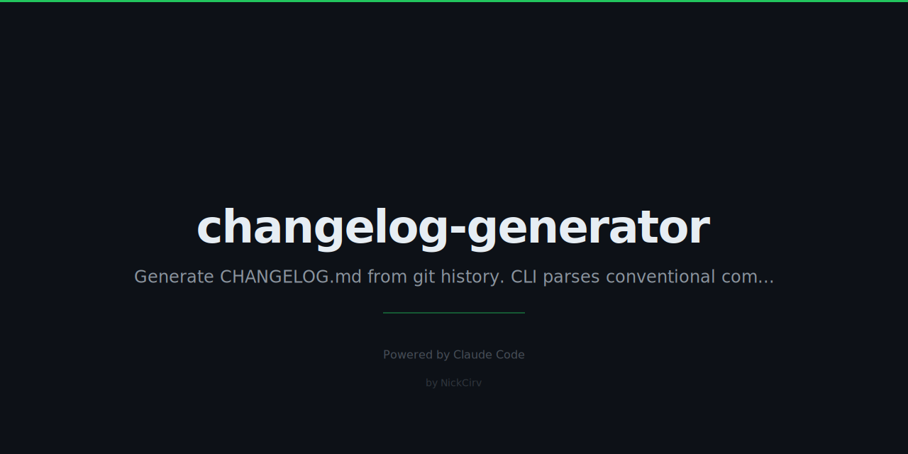

# changelog-generator

> Generate CHANGELOG.md from git history. Conventional commits. Zero dependencies.

```
✨ Features
  - feat(auth): add JWT refresh tokens (`abc1234`) by @dev

🐛 Bug Fixes
  - fix: handle null response from API (`def5678`) by @dev

💥 Breaking Changes
  - feat!: drop Node 16 support (`ghi9012`) by @dev
```

## Install

```bash
# Run without installing
npx changelog-generator

# Install globally
npm install -g changelog-generator
```

## Quick Start

```bash
# Print changelog to stdout
chlog

# Write to file
chlog --output CHANGELOG.md

# Only commits since a tag
chlog --since v1.0.0 --output CHANGELOG.md

# Specific range
chlog --from v1.0.0 --to v2.0.0

# Label unreleased commits with next version
chlog --next-version 2.0.0 --output CHANGELOG.md

# JSON output
chlog --format json

# Include non-conventional commits too
chlog --include-all
```

## Options

| Option | Description | Default |
|--------|-------------|---------|
| `--since <tag>` | Commits since a tag | — |
| `--from <tag>` | Start of range | — |
| `--to <tag>` | End of range (use with `--from`) | — |
| `--output <file>` | Write to file instead of stdout | stdout |
| `--format <fmt>` | Output format: `markdown` or `json` | `markdown` |
| `--repo-url <url>` | GitHub URL for commit/PR links | auto-detected |
| `--next-version <ver>` | Label for unreleased commits | `Unreleased` |
| `--include-all` | Include non-conventional commits | false |
| `--include-merges` | Include merge commits | false |
| `-h, --help` | Show help | — |

## Conventional Commit Types

| Prefix | Section |
|--------|---------|
| `feat` | ✨ Features |
| `fix` | 🐛 Bug Fixes |
| `perf` | ⚡ Performance |
| `refactor` | ♻️ Refactoring |
| `docs` | 📝 Documentation |
| `test` | 🧪 Tests |
| `chore` | 🔧 Maintenance |
| `ci` | 👷 CI/CD |
| `build` | 📦 Build |
| `revert` | ⏪ Reverts |
| `BREAKING CHANGE` / `!` | 💥 Breaking Changes (always first) |

## Output Format

Each entry follows the pattern:

```
- feat(scope): description (#PR) (`abc1234`) by @author
```

Breaking changes are highlighted with `**BREAKING:**` and always appear first.

## Auto-Detection

- GitHub remote URL is auto-detected from `git remote get-url origin` (both SSH and HTTPS formats)
- Semver tags are discovered automatically and used to group commits by version
- Merge commits are excluded by default (`--include-merges` to change)

## Security

- Uses `execFileSync` — never `exec` (no shell injection risk)
- No network calls
- No file system writes unless `--output` is specified
- All sensitive values via `process.env` — nothing hardcoded

## Requirements

- Node.js 18+
- Git installed and on PATH
- Must be run inside a git repository

---

Built with Node.js · Zero dependencies · MIT License
